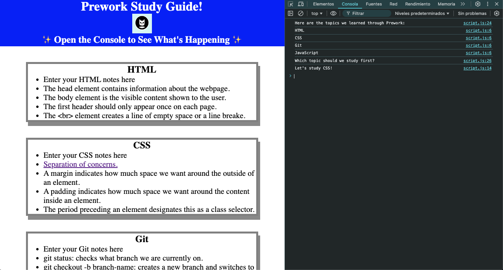

# Prework Study Guide Webpage

## Description

This reopistory is for hosting a public prework study guide webpage. The main purpose inteded for this webpage is to take notes on tools like JavaScript, HTML, Git and CSS, mainly for students from a coding bootcamp or equivalent, so they can view their content in an ogranized fashion and stop losing time trying to find their notes.
In this site you'll also find the topics list and suggestions on what topics you should start study first displayed on the console pane. Instructions are provided in the [usage section](#usage) to acces the console pane.

## Installation

N/A

## Usage

### Open console pane in chrome

**Option 1 - Keyboard shortcut:**
Press `Ctrl+Shift+I` on Windows or Linux; `Command+Option+I` on Mac

**Option 2 - Right click on page:**
1. Right click anywhere on the Prework Study Guide website.
2. Then click "inspect".
3. In the top navigation menu select "Console"
4. Done!

### Preview image:

## Credits

N/A

## License

Please refer to the LICENSE in the repo.
